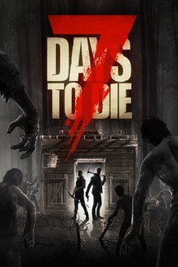

# Games Horror 7 Days To Die

[Stolen from Wikipedia](https://en.wikipedia.org/wiki/7_Days_to_Die)

7 Days to Die is an early access survival horror video game set in an open world developed by The Fun Pimps. It was released through Early Access on Steam for Microsoft Windows and Mac OS X on December 13, 2013,[1] and for Linux on November 22, 2014.[2] Versions for the PlayStation 4 and Xbox One were released in 2016 through Telltale Publishing,[3] but are no longer being developed.[4]

## Story
---
The game's events happen during aftermath of a nuclear Third World War that destroyed an extremely large part of the world, except for some areas such as the fictional county of Navezgane, Arizona. The player is a survivor of the war who must survive by finding shelter, food and water, as well as scavenging supplies to fend off the numerous zombies (hinted to be the consequence of nuclear fallout, a new strain of flu, or both) that populate Navezgane. Though there is no real objective except surviving at this moment, the developers promised a dynamic storyline in the Kickstarter and stretch goals. The video with more explanation has since been removed by the developer.[5]